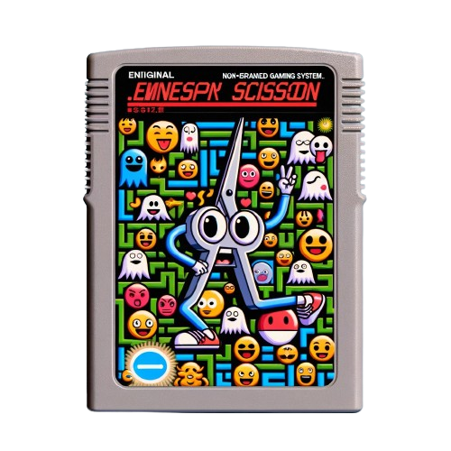

# Emoji Man - 🪨 or 📄 or ✂️

## Overview

Emoji Man is a game based on Rock-Paper-Scissors (RPS) mechanics where players spawn as one of the following: a Rock 🪨, Paper 📄, or Scissors ✂️. The goal is to survive and thrive using the classic RPS rules.

## Resources

- [Dojo Book](https://book.dojoengine.org/)
- [Cairo Book](https://github.com/cairo-book/cairo-book.github.io/)
- [Dojo Engine Discord](https://discord.gg/dojoengine)
- [Awesome Dojo](https://github.com/dojoengine/awesome-dojo)

## Getting Started with the Demo

### Prerequisites

To begin, install Dojo using the following command:

```bash
curl -L https://install.dojoengine.org | bash
```

After installation, run this command to set up:

```bash
dojoup
```

This will install the latest stable release of the Dojo tool suite, currently version [`v0.3.15`](https://github.com/dojoengine/dojo/releases/tag/v0.3.10).

### Optional: Starter Project

For a foundational start, clone the Dojo starter project:

```bash
git clone https://github.com/dojoengine/dojo-starter
```

### Step 1: Initialize the Main Project

Clone the Emoji Man project:

```bash
git clone https://github.com/dojoengine/emoji-man
```

The initial steps include:
a. Project initialization
b. Exploring the project structure
c. Understanding Scarb
d. Introduction to Cairo

### Step 2: Creating Your First Model

Develop your first model by:
a. Conceptualizing the model structure
b. Creating a model and understanding state structures, with insights on [ECS](https://github.com/SanderMertens/ecs-faq)
c. Learning how Dojo is not purely ECS-based

### Step 3: Implementing Your First System

This involves:
a. System creation as a contract
b. Adding a new system
c. Building and testing with `sozo`

### Step 4: Integrating a New Model into a System

Proceed by:
a. Adding a new model
b. Implementing a new trait
c. Utilizing the trait in a system
d. Building and verifying the integration

### Step 5: Exploring Sozo and the CLI

Delve deeper into:
a. `sozo` functionalities
b. Launching `katana`
c. Setting up `torii` and connecting to your World

Refer to the documentation for [`sozo`](https://book.dojoengine.org/toolchain/sozo/reference.html), [`katana`](https://book.dojoengine.org/toolchain/katana/reference.html), and [`torii`](https://book.dojoengine.org/toolchain/torii/reference.html).

### Step 6: Code Cleanup

Focus on:
a. Refining and organizing the code

### Step 7: Testing

Conduct tests by:
a. Establishing a testing structure
b. Writing and executing World deployment tests

### Step 8: Deploying to Katana

Learn about:
a. Deployment processes and debugging techniques

### Step 9: Running the Client

Steps include:
a. Launching the client
b. Generating models via npm
c. Understanding client architecture
d. Learning about the `torii` client

### Step 10: Utilizing `slot` for Remote Deployments

Understand [slot](https://github.com/cartridge-gg/slot) and its applications. Install `slot` and log in with these commands:

```bash
curl -L https://slot.cartridge.sh | bash
slotup
slot auth login
# For old auth credentials debug:
rm ~/Library/Application\ Support/slot/credentials.json
```

Deployment steps:

```bash
# Create and manage deployments
slot deployments create emoji-man-demo katana

# Retrieve and save credentials
slot deployments logs emoji-man-demo katana -f

# Build and migrate releases
sozo --release build
sozo --release migrate

# Set up torii and connect to the world
slot deployments create emoji-man-demo torii --rpc https://api.cartridge.gg/x/emoji-man-demo/katana --world 0x1fad58d91d5d121aa6dc4d16c01a161e0441ef75fe7d31e3664a61e66022b1f --start-block 1

# Update authentication for the release
./scripts/default_auth.sh release
```

### Step 11:

Deploy to vercel.

## Next Steps

### Bonus 1: Add a collectables

- Add a way to spawn collectables on the map and allow players to collect them

### Bonus 2: Leaderboard

- Add UI in client to show total amount of killed types.
